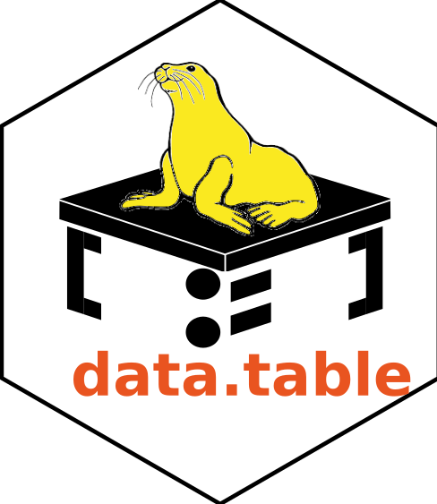

```{r setup, include=FALSE}
options(htmltools.dir.version = FALSE)
library(knitr)
library(kableExtra)
library(ggplot2)
library(emojifont)

# Making some aesthetic changes for this document
theme_set(theme_gray(base_size = 14))
# update_geom_defaults("point", list(size = 1.0))
knitr::opts_chunk$set(fig.dim=c(7.8, 3.8), fig.retina=5, out.width="100%")

options(htmltools.dir.version = FALSE)

# (https://www.garrickadenbuie.com/blog/2018/08/16/decouple-code-and-output-in-xaringan-slides/#using-knitr-fig-chunk)

```

class: middle, center

<div class="rlogo-logo-left-top"></div>

<div class="rdatatable-logo-left-bottom"></div> 

# Getting Started in R and data.table

<br>

### Saghir Bashir <br>ilustat.com<br>16th May 2019


---
class: inverse, middle, center

# Relax

# ExpeRiment

# Make Mistakes

# Learn

# Enjoy

---
class: middle, center

<div class="rlogo-logo-left-top"></div>

<div class="rdatatable-logo-left-bottom"></div> 

# Outline

## Basic R Concepts

## Chick Weight Data

## `data.table` 

## Summary 

---
class: center, middle

# Basic R Concepts

<br>

```{r, out.width = "300px", echo=FALSE}
knitr::include_graphics("images/Rlogo.png")
```

---

<div class="rlogo-logo-right-top"></div>

# Assign Values to Objects

.pull-left[
### Assign (`<-`) values to objects
```{r assign1}
age <- 10
age
Name <- "Leo"
Name
```
]

--

.pull-right[
### R is case sensitive
```{r assign2}
AgE <- 50
AgE #<<
age #<<
```
]

---

<div class="rlogo-logo-right-top"></div>

# R as a Calculator

.pull-left[
```{r calculatorL}
3+2
(8*5)/7
sqrt(5)
5**2
```
]

.pull-right[
```{r calculatorR}
log(5)
exp(1)
round(15.91531, 2)
signif(7461, 2)
```
]

---

<div class="rlogo-logo-right-top"></div>

# More R Concepts

### Assign values to objects

```{r moreConcepts1}
roomLength <- 7.8
roomWidth <- 6.4
```

--

<div class="rlogo-logo-right-top"></div>

### Create a new object from existing objects

```{r moreConcepts2}
roomArea <- roomLength * roomWidth #<<
roomArea
```

---

<div class="rlogo-logo-right-top"></div>

# Vectors

### So far we have seen "scalar" objects (e.g. age, roomArea)

### By combining scalars we can create vectors using `c()`

```{r vectors1}
a1 <- c(102, -14, 15, 89, 3, 75)
a1
b1 <- c("Portugal", "Brazil", "Angola", "Mozambique")
b1
```

---

<div class="rlogo-logo-right-top"></div>

# Vectors: Other Methods

```{r vector2}
c1 <- 1:12
c1
d1 <- rep(c(7:9), 4)
d1
e1 <- seq(from=10, to=12, by=0.5)
e1
```

---

<div class="rlogo-logo-right-top"></div>

# Vector Operations

### You can do calculations on vectors (essential to R thinking)

```{r vectornum}
e1*2
round(sqrt(e1), 2)
```

---

<div class="rlogo-logo-right-top"></div>

# Missing Values: NA

### NA is used to represent missing values in R

```{r missingValues}
Year <- c(1996, NA, 2002, 1985, 1962, 1998)
Year
city <- c("Lisbon", "Warsaw", NA, "Paris", "Rome", NA)
city
```

---

<div class="rlogo-logo-right-top"></div>

# Comments

### Comments are useful for the future you. 

### Comments start from a "#"

```{r comments}
# This comment line is ignored by R #<<
Year
city  # This comment starts after the hash #<<
```

---

<div class="rlogo-logo-right-top"></div>

# Managing Objects

### Use `ls()` to *list* the objects you have stored in R
```{r lsObjects}
ls()

```

### Use `rm()` to *remove* objects
```{r rmObjects}
rm(a1, b1, c1, d1, e1, AgE) #<<
ls()
```

---

<div class="rlogo-logo-right-top"></div>

# Functions

### We have already seen some R functions (e.g, `mean()`, `seq()`)

### A function has a name and list of arguments

```{r functions}
# Name: seq; Arguments: from, to & by
seq(from = 6, to = 9, by = 0.5) #<<
# Name: seq; Arguments: from, to & length.out
seq(from = 8, to = 12, length.out = 9) #<<
```

---

<div class="rlogo-logo-right-top"></div>

# R Packages

<br>

### R Packages are like apps to extend R

### They contain funtions, data and documentation

### For example, data.table is an R package

---
class: inverse, center, middle

# R Demo & Exercises

---
class: inverse, center, middle

# Practical: 50 minutes

<br>

## Work with your neighbours through the 

## "Exercise Sheet: Base R Concepts"

---
class: inverse, center, middle

# Chick Weight Data

---

<div class="rlogo-logo-right-top"></div>

# Chick Weight Data

### Four variables: Chick ID, Diet, Time (days) and Weight (g) 

### 578 observations (50 chicks & 4 diets)

```{r echo=FALSE, eval=TRUE}
suppressMessages(library(data.table))
CW <- as.data.table(ChickWeight)[
    , Chick := as.numeric(as.character(Chick))][
    , Diet := as.factor(Diet)][
    , .(Chick, Diet, Time, weight)][
      order(Chick, Diet, Time)]

fwrite(CW, "ChickWeight.csv")
```

.pull-left[
```{r headCW, echo=FALSE, eval=TRUE}
head(CW) %>% kable(align = 'ccrr', caption = "First 6 observations")
```
]
.pull-right[
```{r tailCW, echo=FALSE, eval=TRUE}
tail(CW) %>% kable(align = 'ccrr', caption = "Last 6 observations")
```
]

---
# Question of Interest

### "The body weights of the chicks were measured at birth and every second day thereafter until day 20. They were also measured on day 21. There were four groups of chicks on different protein diets."

--

## Which of the fours diets leads to the most body weight gain?

---

<div class="ggplot2-hex-right-top"></div>

# Diet Means Over Time 

```{r plotLines, echo=FALSE, eval=TRUE}
ggplot(CW, aes(Time, weight, colour = Diet)) +
  stat_summary(fun.y="mean", geom="line") + 
  xlab("Time (days)") + ylab("Weight (grams)") +
  theme(legend.position = "right") +
  scale_x_continuous(breaks=unique(ChickWeight$Time)) +
  scale_y_continuous(breaks=seq(0, 300, 50))
```

---

<div class="ggplot2-hex-right-top"></div>

# Diet Means Over Time 

```{r plotFacet, echo=FALSE, eval=TRUE}
ggplot(CW, aes(Time, weight, colour = Diet)) +
  stat_summary(fun.y="mean", geom="line") + 
  geom_jitter(width = 0.15) +
  facet_wrap(~Diet) +
  xlab("Time (days)") + ylab("Weight (grams)") +
  scale_x_continuous(breaks=unique(ChickWeight$Time)) +
  scale_y_continuous(breaks=seq(0, 400, 100),limits=c(0,400))
```

---

<div class="knitr-hex-right-top"></div>

# Summary Statistics: Days 0 & 21

<div class="knitr-hex-right-top"></div>

<br> 

```{r mnsdStatCW, echo=FALSE}
sumCW <- CW[, Group := factor(paste0("Diet ", Diet))][
  Time %in% c(0,21),
  .(N      = .N, 
    Mean   = mean(weight),
    SDev   = sd(weight),
    Median = median(weight),
    Min    = min(weight),
    Max    = max(weight)  ),
  by=.(Group, Time)][order(Group, Time)]

sumCW %>% 
  kable(align="ccrrrrrr", digits = c(0, 0, 0, 1, 1, 2, 0, 0)) %>% 
  kable_styling(bootstrap_options = "striped", font_size = 24, full_width = TRUE) %>% 
  column_spec(1:8, width = "4em") %>% 
  collapse_rows(1, valign = "top")
```

---
class: center, middle

```{r, out.width = "400px", echo=FALSE}

```

---
class: inverse, center, middle

# Install `data.table` package

<br>

# `install.packages("data.table")`


---

<div class="rdatatable-logo-right-top"></div>

# Import the data: `fread()`

### First load `data.table` using the `library()` function

```{r importCWhide, echo=FALSE, eval=TRUE}
suppressMessages(library(data.table))
cw <- fread("ChickWeight.csv")
```

```{r importCWshow, echo=TRUE, eval=FALSE}
library(data.table)
cw <- fread("ChickWeight.csv")
cw
```

```{r cwShow, echo=FALSE}
cw
```

---

<div class="rlogo-logo-right-top"></div>

# Data Structure

```{r dataStr, highlight.output=c(1:5)}
str(cw)
```

---

class: inverse, center, middle

# `dt[i, j, by]`

<br>

# `dt[rows, columns, groups]`


---

<div class="rdatatable-logo-right-top"></div>

# `dt[i]`: Filter Rows

.pull-left[
```{r filterRows1, echo=2}
options(datatable.print.nrows=8)
cw[Time==21]
```
]
--
.pull-right[
```{r filterRows2}
cw
```
]

## `cw` did not change!

---

<div class="rdatatable-logo-right-top"></div>

# `dt[i]`: Filter Rows

.pull-left[
```{r filterRows3}
cw[Time==21 & weight>=300]
```
]
--
.pull-right[
```{r filterRows4}
cw
```
]

## `cw` did not change!


---
<div class="rdatatable-logo-right-top"></div>

# `dt[i]`: Order Rows

.pull-left[
```{r orderRows1, highlight.output=c(2, 12)}
cw[order(weight)]
```
  ]
--
.pull-right[
```{r orderRows2}
cw
```
]

## `cw` did not change!

---

<div class="rdatatable-logo-right-top"></div>

# `dt[i]`: Order Rows - Descending

.pull-left[
```{r orderRows3, highlight.output=c(2, 12)}
cw[order(-weight)]
```
  ]
--
.pull-right[
```{r orderRows4}
cw
```
]

### `cw` did not change!

---

<div class="rdatatable-logo-right-top"></div>

# `dt[, j]`: Add New Column 

### `:=` adds a column (`cw` changes)

```{r newVar, highlight.output=c(1)}
cw[, weightKg := weight/1000] #<<
cw
```

---

<div class="rdatatable-logo-right-top"></div>

# `dt[, j]`: Add Multiple Columns

### Use \`:=\` to add multiple columns  (`cw` changes)

```{r newVars, highlight.output=c(1)}
cw[, `:=`(Hours=24*Time, LongD=paste0("Diet ", Diet))] #<<
cw
```

---
<div class="rdatatable-logo-right-top"></div>

# Drop Columns

.pull-left[
```{r dropCol, highlight.output=c(1)}
# Drop One Column #<<
cw[, weightKg:=NULL]
cw
```
 ]
--
.pull-right[
```{r dropCols, highlight.output=c(1)}
# Drop Multiple Columns #<<
cw[, c("Diet", "Hours"):=NULL]
cw
```
  ]
  
### Dropping columns changes `cw`

---

<div class="rdatatable-logo-right-top"></div>

# `setnames()`: Renaming Columns

.pull-left[
```{r renameOrig, highlight.output=c(1)}
# Current cw
cw
```
]
--
.pull-right[
```{r renameVars, highlight.output=c(1)}
# Rename: weight to Weight & LongD to Group
setnames(cw, c("weight", "LongD"), 
             c("Weight", "Group"))
cw
```
]

### `setnames()` changes `cw` `r emoji('smiley')`

---

<div class="rdatatable-logo-right-top"></div>

# `dt[, j]`: Column Order

.pull-left[

```{r reorderVar1, highlight.output=c(1)}
cw[, .(Weight, Time, Group, Chick)]
```
 ]
--
.pull-right[

```{r orderSame, highlight.output=c(1)}
cw
```
]

## `cw` did not change!

---

<div class="rdatatable-logo-right-top"></div>

# `setcolorder()`: Column Order

```{r reorderVar2, highlight.output=c(1)}
setcolorder(cw, c("Group", "Chick", "Time", "Weight"))
cw
```

## `setcolorder()` changes `cw` `r emoji('smiley')`


---

<div class="rdatatable-logo-right-top"></div>

# `dt[, j, by]`: Summary Statistics

.pull-left[
```{r dtSumStat1}
cw[, .(Mean=mean(Weight), SD=sd(Weight))
   , by = .(Group, Time)]
```
]
--
.pull-right[
```{r dtSumStat2}
# `cw` did not change!
cw
```
]

---

<div class="rdatatable-logo-right-top"></div>

# `dt[, j, by]`: Summary Statistics

```{r sumstat2, highlight.output=c(1), echo=2:3}
#options(digits = 2)
cwSum <- cw[, .(Mean = mean(Weight), SD = sd(Weight)), by = .(Group, Time)] 
cwSum #<<
```

## Assigned summary statistics to `cwSum` `r emoji('smiley')`

---

<div class="rdatatable-logo-right-top"></div>

# Chaining: Multiple Steps

### To do multiple steps together use `cw[...][...][...]...`

```{r chaining, echo=3:6}
printDigits <- getOption("digits")
options(digits = 3)
cw[Time %in% c(0, 21)][ #<<
  , .(N = .N, Mean = mean(Weight), SD = sd(Weight)), by = .(Group, Time)][ #<<
    order(Group, Time)] #<<
```

---

<div class="rdatatable-logo-right-top"></div>

# Final Summary Statistics

```{r dtSum, echo=2:3}
options(digits=2)  	# tighter display here
cws <- cw[Time %in% c(0, 21),
  .(N      = .N, 
    Mean   = mean(Weight),
    SDev   = sd(Weight),
    Median = median(Weight),
    Min    = min(Weight),
    Max    = max(Weight)  ),
  by=.(Group, Time)][
    order(Group, Time)]
cws
```

---

<div class="knitr-hex-right-top"></div>

# Prettier Table

### Summary Statistics for the Chick Weight Data
```{r prettySum, echo = FALSE}
cws %>% kable(align="llrrrrrr", digits = c(0, 0, 0, 1, 1, 1, 0, 0)) %>% 
  kable_styling(bootstrap_options = "striped", font_size = 24) %>% 
  column_spec(1:8, width="4em") %>% 
  collapse_rows(1, valign = "top")
```

---
class: inverse, center, middle

# R Markdown Demo


---
class: inverse, center, middle


# data.table Practical

<br>

### World Population Data

### Download: https://ilustat.com/shared/GSiRdt.zip

### Double Click on "World-Popn-dt.Rproj"


---

<div class="xaringan-hex-right-top"></div>

# Summary

### Assigning (`<-`) values to objects (e.g. vectors, data.table) 

### Manipulating Vectors

### `data.table`: `dt[i, j, by]`

### `dt[i, ]` to filter or order rows

### `dt[, j]` to create, rename and select columns

### `dt[, j, by]` to do grouping operations on columns `j`


---
class: inverse, center, middle

# Thank You

<br> 

## Follow us on Twitter at: [@ilustat](https://twitter.com/ilustat)

---
class: inverse, center, middle

## This work is licensed under the

## Creative Commons Attribution-NonCommercial 4.0 International License.

## To view a copy of this license, visit

## http://creativecommons.org/licenses/by-nc/4.0/

