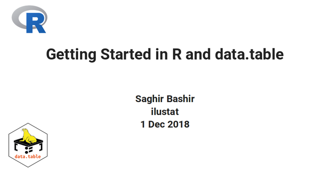

# Teaching materials: R Intro & `data.table`

> Teaching materials for "[Getting Started in R - Tinyverse Edition](https://eddelbuettel.github.io/gsir-te/Getting-Started-in-R.pdf)"

An introduction to basic R concepts and the `data.table` package.

# Why `data.table`?

- `data.table` is a great, high quality and well maintained package with a strong
development team.
- It is **fast** and **memory efficient**. 
  - Including reading and writing data.
- It has no dependencies and works out of the box :)
- Knowing this package will increase your knowledge and understanding of R.

For more information see [http://r-datatable.com](http://r-datatable.com)

# Contents

The materials presented in this repository are complementary to [Getting Started in R - Tinyverse Edition](https://eddelbuettel.github.io/gsir-te/Getting-Started-in-R.pdf)

- Presentation
  + Main presentation for workshop
- Exercises 
  + Base R concepts Exercise sheet
  + World populations case study
- Share-During
  + Materials to distribute **during** the workshop (ZIP)
    + Base R Exercises (PDF)
    + [Getting Started in R - Tinyverse Edition](https://eddelbuettel.github.io/gsir-te/Getting-Started-in-R.pdf) (PDF)
    + Chick weight data (CSV)
    + World population exercises (Rmarkdown)
- Share-After (ZIP)
  + Materials to distribute **after** the workshop 
    + Solutions to world population exercises (HTML)
    + Main presentation (HTML)

# Acknowledgements

Thanks to [Matt Dowle](https://github.com/mattdowle), [Arun Srinivasan](https://github.com/arunsrinivasan) and all the `data.table` [team](https://github.com/orgs/Rdatatable/people) and contributors for such a great package.

